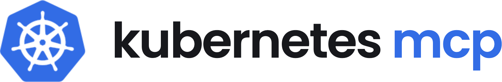

# Kubernetes MCP Server

[](https://kubernetes.io/)
[](https://www.docker.com/)

<p align="center">
  
</p>

An [MCP (Model Context Protocol)](https://modelcontextprotocol.io) server that lets AI assistants (Claude, Codex, Cursor, ...) manage Kubernetes clusters. It wraps `kubectl` and `helm` behind 23 typed tools, with argv-injection guards, secret masking, and tool/namespace gating so the server can be locked down to read-only, non-destructive, or single-namespace operation.

> Fork of [Flux159/mcp-server-kubernetes](https://github.com/Flux159/mcp-server-kubernetes), refactored for local/internal use. **Not published to npm or Docker Hub** — `npx mcp-server-kubernetes` resolves to the original upstream package, not this codebase. Build from source and point your MCP client at the local `dist/index.js`.

## Installation & Usage

### Prerequisites

1. `kubectl` on your PATH and a valid kubeconfig with configured contexts
2. Access to a Kubernetes cluster (minikube, Rancher Desktop, GKE, ...) — verify with `kubectl get pods`
3. Helm v3 on your PATH (optional, only for the Helm tools)
4. Node.js >= 18

### 1. Clone and build

```bash
git clone https://github.com/phuquocchamp/kubernetes-mcp.git
cd kubernetes-mcp
npm install
npm run build    # produces dist/index.js
echo "$(pwd)/dist/index.js"   # note the absolute path — every config below needs it
```

> **If you are an AI agent installing this**: use the absolute path printed above, never a relative one. Verify `dist/index.js` exists before writing any client config. Default to user scope unless the user asked for project (shared) scope.

### 2. Configure your MCP client

**Claude Code / Codex CLI:**

```bash
claude mcp add kubernetes -- node /absolute/path/to/kubernetes-mcp/dist/index.js
codex  mcp add kubernetes -- node /absolute/path/to/kubernetes-mcp/dist/index.js
```

**Claude Desktop / Cursor / VS Code / project `.mcp.json`** — merge under `mcpServers`:

```json
{
  "mcpServers": {
    "kubernetes": {
      "command": "node",
      "args": ["/absolute/path/to/kubernetes-mcp/dist/index.js"],
      "env": {
        "KUBECONFIG_PATH": "/absolute/path/to/your-cluster.yaml",
        "ALLOWED_NAMESPACES": "team-a,team-a-workers",
        "ALLOW_ONLY_NON_DESTRUCTIVE_TOOLS": "true"
      }
    }
  }
}
```

The `env` block is optional — without it the server uses `~/.kube/config`, all namespaces, and all tools. Every option is listed under [Configuration](#configuration). The path must be absolute; restart the client (or reconnect MCP) after editing, then verify by asking the assistant to list your pods.

## Tools

23 tools, grouped by the permission category the gating env vars use. `*` marks a required param. Every `namespace`/`allNamespaces` param is also subject to [`ALLOWED_NAMESPACES`](#restricting-namespace-access) when set.

| Name | Permission | Params | Description |
|---|---|---|---|
| `kubectl_get` | read-only | `resourceType`*, `name`, `namespace`, `output`, `allNamespaces`, `labelSelector`, `fieldSelector`, `sortBy`, `context` | Get or list resources by type, name, and optionally namespace |
| `kubectl_describe` | read-only | `resourceType`*, `name`*, `namespace`, `context`, `allNamespaces` | Describe a resource |
| `kubectl_logs` | read-only | `resourceType`* (pod\|deployment\|job\|cronjob), `name`*, `namespace`, `container`, `tail`, `since`, `sinceTime`, `timestamps`, `previous`, `follow`, `labelSelector`, `context` | Get logs from pods, deployments, or jobs |
| `kubectl_context` | read-only | `operation` (list\|get\|set, default list), `name`, `showCurrent`, `detailed`, `output` | List, get, or set the current kubectl context |
| `kubectl_reconnect` | read-only | — | Recreate all API clients (e.g. after a control-plane upgrade rotates IPs) |
| `explain_resource` | read-only | `resource`*, `apiVersion`, `recursive`, `context`, `output` | Get documentation for a resource or field |
| `list_api_resources` | read-only | `apiGroup`, `namespaced`, `context`, `verbs`, `output` | List the API resources available in the cluster |
| `ping` | read-only | — | Verify the server is responsive |
| `kubectl_apply` | non-destructive† | `manifest`, `filename`, `namespace`, `dryRun`, `force`, `context` | Apply a YAML manifest from a string or file |
| `kubectl_create` | non-destructive | `resourceType`, `name`, `namespace`, `manifest`, `filename`, `fromLiteral`, `fromFile`, `fromFileContent`, `secretType`, `serviceType`, `tcpPort`, `image`, `replicas`, `port`, `schedule`, `suspend`, `command`, `labels`, `annotations`, `dryRun`, `output`, `validate`, `context` | Create resources from a manifest or via kubectl subcommands (configmap, secret, deployment, service, cronjob, job, ...) |
| `kubectl_patch` | non-destructive | `resourceType`*, `name`*, `namespace`, `patchType` (strategic\|merge\|json), `patchData`, `patchFile`, `dryRun`, `context` | Update field(s) of a resource |
| `kubectl_scale` | non-destructive | `name`*, `namespace`, `replicas`*, `resourceType` (default deployment), `context` | Scale a deployment/statefulset/replicaset |
| `kubectl_rollout` | non-destructive | `subCommand` (history\|pause\|restart\|resume\|status\|undo), `resourceType` (deployment\|daemonset\|statefulset), `name`*, `namespace`, `revision`, `toRevision`, `timeout`, `watch`, `context` | Manage a rollout |
| `install_helm_chart` | non-destructive† | `name`*, `chart`*, `namespace`, `context`, `repo`, `values`, `valuesFile`, `useTemplate`, `createNamespace` | Install a Helm chart (`useTemplate` = `helm template` + `kubectl apply`, bypasses auth issues) |
| `upgrade_helm_chart` | non-destructive | `name`*, `chart`*, `namespace`, `context`, `repo`, `values`, `valuesFile` | Upgrade a Helm release |
| `port_forward` | non-destructive | `resourceType`*, `resourceName`*, `localPort`*, `targetPort`*, `namespace` | Forward a local port to a resource |
| `stop_port_forward` | non-destructive | `id`* | Stop a running port-forward |
| `exec_in_pod` | non-destructive† | `name`*, `namespace`, `command`* (array — no shell interpretation), `container`, `timeout`, `context` | Execute a command in a pod/container |
| `kubectl_delete` | **destructive** | `resourceType`, `name`, `namespace`, `labelSelector`, `manifest`, `filename`, `allNamespaces`, `force`, `gracePeriodSeconds`, `context` | Delete resources by type/name, labels, or manifest |
| `uninstall_helm_chart` | **destructive** | `name`*, `namespace`, `context` | Uninstall a Helm release |
| `cleanup` | **destructive** | — | Delete every resource this server session created |
| `kubectl_generic` | **destructive** | `command`*, `subCommand`, `resourceType`, `name`, `namespace`, `allNamespaces`, `outputFormat`, `flags`, `args`, `context` | Run any kubectl command with arbitrary args/flags |
| `node_management` | **destructive** | `operation`* (cordon\|drain\|uncordon), `nodeName`, `force`, `gracePeriod`, `deleteLocalData`, `ignoreDaemonsets`, `timeout`, `dryRun`, `confirmDrain` | Cordon, drain (requires `confirmDrain`), or uncordon nodes |

- **Read-only mode** (`ALLOW_ONLY_READONLY_TOOLS=true`) registers only the 8 read-only tools.
- **Non-destructive mode** (`ALLOW_ONLY_NON_DESTRUCTIVE_TOOLS=true`) removes exactly the 5 **destructive** tools.
- A gated tool is never *registered* (it does not appear in `tools/list`), not registered-then-refused. Gating is driven solely by the `READONLY_TOOL_NAMES` / `DESTRUCTIVE_TOOL_NAMES` sets in `src/server.ts`.
- † carries an MCP `destructiveHint: true` annotation for client UIs but is **not** in the destructive gating set, so it stays enabled in non-destructive mode.

## Features

- **Security hardening**: kubectl/helm argv-injection guards (credential/endpoint-redirecting flags are refused), secret masking in `kubectl get secrets` output, bearer-token auth and DNS-rebinding protection on remote transports
- **Gating**: tool allowlist/read-only/non-destructive modes and a namespace allowlist (`ALLOWED_NAMESPACES`)
- **Multi-source kubeconfig**: inline YAML/JSON, bearer token, in-cluster service account, custom path, or `~/.kube/config`
- **Transports**: stdio (default), SSE, Streamable HTTP
- **Observability**: opt-in OpenTelemetry tracing of every tool call (OTLP export, configurable sampling) — see [docs/observability.md](docs/observability.md)
- **Diagnostic prompt**: `k8s-diagnose` — a guided pod-troubleshooting flow, taking a `keyword` and optional `namespace`

## Configuration

Everything is configured through the `env` block of your MCP client config (or the process environment). The server reads no `.env` file.

### Kubeconfig source (first match wins)

| Priority | Env var(s) | Purpose |
|---|---|---|
| 1 | `KUBECONFIG_YAML` | Inline kubeconfig as YAML |
| 2 | `KUBECONFIG_JSON` | Inline kubeconfig as JSON |
| 3 | `K8S_SERVER` + `K8S_TOKEN` (+ `K8S_CA_DATA`, `K8S_SKIP_TLS_VERIFY`) | Minimal config from a bearer token |
| 4 | *(none)* | In-cluster service account, when running in a pod |
| 5 | `KUBECONFIG_PATH` | Path to a specific kubeconfig file |
| 6 | `KUBECONFIG` | Standard kubectl env var |
| 7 | *(none)* | `~/.kube/config` |

After loading: `K8S_CONTEXT` selects a context from that file; `K8S_NAMESPACE` sets the namespace tools use when none is passed (default `default`).

### Server behavior (`src/core/config.ts`)

| Env var | Default | Purpose |
|---|---|---|
| `ALLOW_ONLY_READONLY_TOOLS` | `false` | Register only the 8 read-only tools |
| `ALLOW_ONLY_NON_DESTRUCTIVE_TOOLS` | `false` | Do not register the 5 destructive tools |
| `ALLOWED_TOOLS` | *(unset)* | Comma-separated explicit tool allowlist; overrides the two flags above; an unknown name fails startup |
| `ALLOWED_NAMESPACES` | *(unset)* | Comma-separated namespace allowlist — see [below](#restricting-namespace-access) |
| `MASK_SECRETS` | `true` | Mask values in `kubectl get secrets` output |
| `ALLOW_KUBECTL_UNSAFE_FLAGS` | `false` | Allow flags that redirect the API server / substitute credentials (`--server`, `--token`, `--kubeconfig`, ...) — a prompt-injection defense, leave off |
| `SPAWN_MAX_BUFFER` | `10485760` | Max stdout bytes from a kubectl/helm process |
| `ENABLE_UNSAFE_STREAMABLE_HTTP_TRANSPORT` / `ENABLE_UNSAFE_SSE_TRANSPORT` | *(unset)* | Use a remote transport instead of stdio; "unsafe" because it must be paired with `MCP_AUTH_TOKEN` |
| `HOST` / `PORT` | `localhost` / `3000` | Bind address for a remote transport |
| `MCP_AUTH_TOKEN` | *(unset)* | Shared secret required as `X-MCP-AUTH` header on remote transports |
| `DNS_REBINDING_PROTECTION` / `DNS_REBINDING_ALLOWED_HOST` | `true` / *(unset)* | `Host`-header check on remote transports, and its override for reverse proxies |
| `ENABLE_TELEMETRY` + `OTEL_EXPORTER_OTLP_ENDPOINT` | *(unset)* | Turn on OpenTelemetry tracing; further `OTEL_*` knobs in [docs/observability.md](docs/observability.md) |

### Restricting Namespace Access

If your kubeconfig's RBAC already scopes the identity to certain namespaces, that is the real enforcement boundary — the Kubernetes API server checks it and nothing the client sends can bypass it. `ALLOWED_NAMESPACES` is an optional guardrail on top: an allowlist the server checks itself, before a request reaches the cluster, useful when the kubeconfig identity is broader than the access you want to expose.

```json
"env": {
  "KUBECONFIG_PATH": "/absolute/path/to/your-cluster.yaml",
  "ALLOWED_NAMESPACES": "staging,default"
}
```

- Any `-n`/`--namespace` value outside the list is refused with a clear error, in every form kubectl/helm accept (`-n staging`, `-nstaging`, `--namespace staging`, `--namespace=staging`).
- `--all-namespaces`/`-A` is refused while the allowlist is set.
- Commands with no namespace flag (`kubectl_get nodes`, `list_api_resources`, `kubectl_context`, ...) are unaffected — this restricts namespace *scope*, not which commands are namespaced.
- Most tools fall back to namespace `default` when none is passed, so include `default` in the list or point `K8S_NAMESPACE` at an allowed namespace.

## Architecture

```
src/
├── index.ts               # entrypoint: load config, build server, pick transport
├── server.ts              # tool registry + gating (ALL_TOOL_NAMES, READONLY/DESTRUCTIVE sets, REGISTRARS)
├── core/
│   ├── config.ts          # Zod schema for the env vars above
│   ├── kubectl.ts         # runKubectl/runHelm — the single execFile choke point; every argv guard runs here
│   ├── errors.ts          # normalizeError → KubectlError (never leaks raw stderr)
│   ├── telemetry.ts       # OpenTelemetry spans around each command
│   ├── operations/        # pure logic: build kubectl/helm argv, parse output (unit-tested with fake deps)
│   ├── format/            # render an operation's result as tool text
│   └── security/          # argv guards: dangerous flags, file reads, namespace allowlist
├── tools/                 # thin registrars: Zod input schema → operation → format
├── prompts/index.ts       # k8s-diagnose
├── resources/handlers.ts  # MCP resource endpoints
├── security/              # transport auth + DNS-rebinding allowlist
└── utils/kubernetes-manager.ts  # kubeconfig source resolution + API clients
```

Layering: `tools/*.ts` (MCP/Zod adapter) → `core/operations/*.ts` (pure kubectl/helm logic) → `core/format/*.ts` (text response). Every command funnels through `core/kubectl.ts`, so the injection guards and the namespace allowlist live in one place rather than per tool. `CLAUDE.md` has the contributor contract for adding a tool.

## Development

```bash
npm run dev        # tsc --watch
npm test           # unit suite — no cluster, no kubectl/helm needed; must stay green
npm run test:e2e   # builds, then runs the e2e suite against your current kubectl context
npm run test:all   # both
npm run build      # tsc → dist/

npx @modelcontextprotocol/inspector node dist/index.js      # drive the server without a client
npx mcp-chat --server "node dist/index.js"                 # same, via the mcp-chat CLI
```

For a Docker image, `docker build -t kubernetes-mcp .` — multi-stage, ships kubectl/helm/gcloud/awscli, runs as non-root.

## Releases

Local-only — nothing is published to npm or Docker Hub, and there is no CI/CD. To release: `npm run version:update <x.y.z>` (bumps `package.json` and `src/config/server-config.ts` together), `npm install --package-lock-only`, commit as `Bump version to <x.y.z>`, then create a `v<x.y.z>` GitHub release on the [releases page](https://github.com/phuquocchamp/kubernetes-mcp/releases). Never edit the version fields by hand.

## Not planned

Adding clusters to kubectx.
